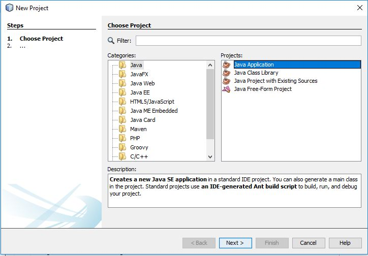
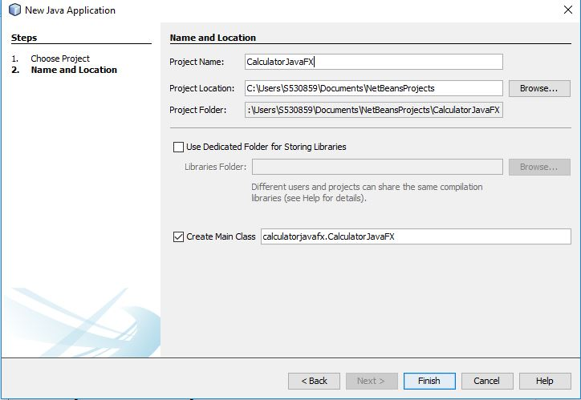

##  1. Create a Java Project and name it as a CalculatorJavaFX as shown below
###  
###  
##  2. Extend the CalculatorJavaFX class to the Application class
##  3. Import The Applcation class from import javafx.application.Application
##  4. Invoke launch static method from Application class which in turn will invoke start method with Stage as argunment
##  5. Create a button using Button Class provided by JavaFX
###
###       Button btn = new Button("Helloworld");
###        btn.setOnAction(new EventHandler<ActionEvent>(){
###           public void handle(ActionEvent e){
###             System.out.println("clicked");
###            }
###        });
###        
###        Scene scene = new Scene(btn, 200,200);
###        primaryStage.setScene(scene);
###        primaryStage.show();
##   6. Creata a label using Label Class provided by JavaFX
### 
###      Label label = new Label("Helloworld");
###      label.setAlignment(Pos.CENTER);
###      label.setStyle("-fx-border-color: black; -fx-border-width: 2px; -fx-color: brown;                                      -fx-background-color: yellow;");
###      StackPane pane = new StackPane();
###      pane.getChildren().add(label);
###      Scene scene = new Scene(pane, 200,200);
###      primaryStage.setScene(scene);
###      primaryStage.show();
##   7. Create a grid layout using the GridPane class provided by the JavaFX
###      GridPane pane = new GridPane();
###      pane.setAlignment(Pos.CENTER);
###      pane.addRow(0, new Button("1"),new Button("2"),new Button("3"));
###      pane.addRow(1, new Button("4"),new Button("5"),new Button("6"));
###      pane.addRow(2, new Button("7"),new Button("8"),new Button("9"));
###      pane.setGridLinesVisible(true);
###      
###      Scene scene = new Scene(pane, 200,200);
###      primaryStage.setScene(scene);
###      primaryStage.show();
###   8. The source Code for the calculator is Shown Below

#####         // Declare a variable of type Label to display result
#####         private Label reslabel;
#####         // Declare and initialize a variable of type string inorder to store the operator selected
#####          private ArrayList<String> operator = new ArrayList<>();
#####          // Declare and initialize a variable of type Integer inorder to store the operand 1
#####          private double num1 = 0;
#####          // Declare and initialize a variable of type DoubleProperty for binding the fontsize
#####          private DoubleProperty fontSize = new SimpleDoubleProperty(10);
#####          // Declare and initialize an arraylist for all the button labels
#####          private List<String> btnlabels = Arrays.asList("0", "1", "2", "3", "4", "5", "6","7", "8", "9", "C",                 "=", "+", "-", "*", "/", ".");

#####          private Button btnclear;
#####          // declare and initialize an arraylist of buttons
#####          private ArrayList<Button> btns = new ArrayList<>();

#####          private ArrayList<Double> operands = new ArrayList<>();

#####          private Boolean cancelflag = true, divideoverflowflag = true, operatorflag = false;

#####          // This method is called from launch static method of Application class by the JVM itself
#####          @Override
#####          public void start(Stage primaryStage) {
#####              //create a grid layout
#####              GridPane gridPane = new GridPane();
#####              // set vertical space between grid cells to be 5px
#####              gridPane.setVgap(5);
#####              // set Horizontal space between grid cells to be 5px
#####              gridPane.setHgap(5);
#####              //Setting the padding  
#####              gridPane.setPadding(new Insets(10));
#####              //Setting the Grid alignment 
#####              gridPane.setAlignment(Pos.CENTER);

#####              // create instances of each button and add them to arraylist
#####              for (String str : btnlabels) {
#####                Button btn = new Button(str);
#####                  btn.setMinWidth(50);
#####                  btn.prefWidthProperty().bind(gridPane.widthProperty());
#####               btn.prefHeightProperty().bind(gridPane.heightProperty());
#####               btn.setOnAction(e -> btncode(e));
#####               btns.add(btn);
#####                }

#####               // create a result label and set width and color
#####               reslabel = new Label("");
#####               reslabel.setStyle("-fx-alignment: RIGHT;-fx-border-color: black;-fx-font-size:                                          2em;-fx-background-color: white;");
#####               reslabel.setMinWidth(220);
#####               reslabel.setMinHeight(20);
#####               reslabel.prefWidthProperty().bind(gridPane.widthProperty());
#####               reslabel.prefHeightProperty().bind(gridPane.heightProperty());

#####               // create a clear button and set width and font styles
#####               btnclear = new Button("Clear");
#####               btnclear.setMinWidth(160);
#####               btnclear.setStyle("-fx-background-color: #f9613b;                                                #####                             -fx-text-fill: white; -fx-font-weight: bold;");
#####               btnclear.prefWidthProperty().bind(gridPane.widthProperty());
#####               btnclear.prefHeightProperty().bind(gridPane.heightProperty());
#####               btnclear.setOnAction(e -> btncode(e));

#####               // attach the created nodes to the layout
#####               gridPane.add(reslabel, 0, 0, 4, 1);
#####               gridPane.add(btnclear, 0, 1, 3, 1);
#####               gridPane.add(btns.get(16), 3, 1);
#####               gridPane.addRow(2, btns.get(7), btns.get(8), btns.get(9), btns.get(15));
#####               gridPane.addRow(3, btns.get(4), btns.get(5), btns.get(6), btns.get(14));
#####               gridPane.addRow(4, btns.get(1), btns.get(2), btns.get(3), btns.get(13));
#####               gridPane.addRow(5, btns.get(10), btns.get(0), btns.get(11), btns.get(12));

#####               // create a scene with gridpane as scene graph
#####               Scene scene = new Scene(gridPane, 400, 350);

#####               // Bind the font size with the size of the window
#####               fontSize.bind(scene.widthProperty().add(scene.heightProperty()).divide(50));
#####               gridPane.styleProperty().bind(Bindings.concat("-fx-font-size: ",                                 #####                      fontSize.asString(), ";",
#####                     "-fx-base: rgb(156,179,216);"));
#####               // set title for the stage (window)
#####               primaryStage.setTitle("Calculator");

#####               //set scene for the stage
#####               primaryStage.setScene(scene);

#####               //show the stage
#####               primaryStage.show();
#####            }

#####             // For every button click the below method is called to process the request
#####                 public void btncode(ActionEvent e) {
#####           // if clear button is clicked remove the text from result label
#####            if ("Clear".equals(((Button) e.getSource()).getText())) {
#####                reslabel.setText("");
#####                operator.clear();
#####                operands.clear();
#####                divideoverflowflag = true;
#####                cancelflag = true;
#####                operatorflag = false;
#####                return;
#####            }
#####            // if cancel is clicked the last element from result label is removed
#####            if ("C".equals(((Button) e.getSource()).getText())) {
#####                if (!reslabel.getText().equals("") && cancelflag && divideoverflowflag) {
#####           reslabel.setText(reslabel.getText().substring(0, reslabel.getText().length() - 1));
#####                }
#####                return;
#####            }
#####            // if any of the operator is clicked, store the operator and empty the result label
#####            if (divideoverflowflag && ("+".equals(((Button) e.getSource()).getText())
#####              || "-".equals(((Button) e.getSource()).getText())
#####              || "*".equals(((Button) e.getSource()).getText())
#####              || "/".equals(((Button) e.getSource()).getText()))) {
#####                   if (operatorflag) {
#####                       cancelflag = true;
#####                       if (!reslabel.getText().equals("")) {
#####                           operands.add(Double.parseDouble(reslabel.getText()));
#####                           operator.add(((Button) e.getSource()).getText());
#####                           reslabel.setText("");
#####                           operatorflag = false;
#####                       }
#####                   }
#####              return;
#####          }

#####               // if equals operator is clicked then the required operation is performed and result is loaded will be loaded into result label
#####              if ("=".equals(((Button) e.getSource()).getText()) && divideoverflowflag) {
#####                  if (operatorflag) {
#####                      int i = 0;
#####                      double result = operands.get(i);
#####                      operands.add(Double.parseDouble(reslabel.getText()));
#####                      for (String op : operator) {
#####               i = i + 1;
#####               if (!op.equals("")) {
#####                   switch (op) {
#####                       case "+":
#####                result += operands.get(i);
#####                break;
#####                       case "-":
#####                result -= operands.get(i);
#####                break;
#####                       case "*":
#####                result *= operands.get(i);
#####                break;
#####                       case "/":
#####                if (operands.get(i) == 0) {
#####                    reslabel.setText("Cannot divide by zero");
#####                    cancelflag = false;
#####                    divideoverflowflag = false;
#####                    return;
#####                }
#####                result /= operands.get(i);
#####                break;
#####                   }
#####               }

#####              }
#####              operands.clear();
#####              operator.clear();
#####              cancelflag = false;
#####              if ((result == Math.floor(result)) && !Double.isInfinite(result)) {
#####               reslabel.setText(String.format("%,d", (int) result));
#####               return;
#####              }
#####              reslabel.setText(String.format("%.3f", result));
#####              return;
#####          } else {
#####              return;
#####          }
#####      }

#####       if (divideoverflowflag) {
#####       cancelflag = true;
#####       operatorflag = true;
#####       // if any of the number is clicked, the respective number will be added to the result label
#####         reslabel.setText(reslabel.getText() + ((Button) e.getSource()).getText());
#####       }

#####     }

